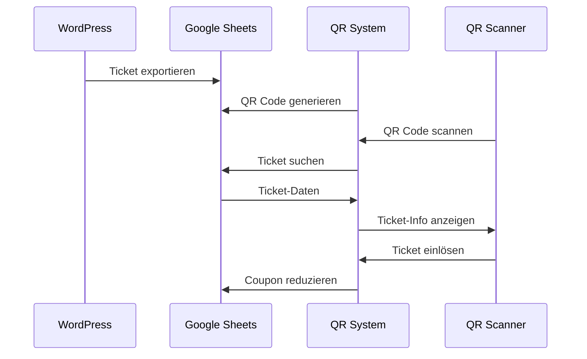

# QR Code Lifecycle

## 1. Datenstruktur in Google Sheets

| Spalte | Inhalt | Beschreibung |
|--------|---------|-------------|
| A | Name | Teilnehmername |
| B | Ticket ID | Eindeutige Ticket-Kennung |
| C | QR Code | Base64-kodierter QR Code |
| D | Email | Teilnehmer E-Mail |
| E | Coupons | Anzahl verbleibender Eintritte |
| F | Order ID | Bestellnummer |

## 2. Ticket-Lebenszyklus

### 2.1 Ticket-Erstellung
1. WordPress Plugin exportiert Ticket-Daten nach Google Sheets
2. Initial sind Spalten A, B, D, E, F gefüllt
3. Spalte C (QR) ist zunächst leer

### 2.2 QR-Code Generierung
```javascript
// GenerateQR Funktion
1. System liest Ticket-Daten aus Sheet
2. Generiert QR-Code aus Ticket-ID (Spalte B)
3. Speichert QR als Base64 in Spalte C
```

### 2.3 Ticket-Validierung (Scan)
```javascript
// ScanQR Funktion
1. Scanner liest QR-Code
2. Extrahiert Ticket-ID
3. Sucht ID in Google Sheet (Spalte B)
4. Wenn gefunden:
   - Gibt Name und verbleibende Coupons zurück
   - Status: 200 OK
5. Wenn nicht gefunden:
   - Fehler "User didn't register"
   - Status: 404 Not Found
```

### 2.4 Ticket-Einlösung
```javascript
// RedeemQR Funktion
1. Prüft verbleibende Coupons (Spalte E)
2. Wenn Coupons = 0:
   - Fehler "All Coupons Scanned"
   - Status: 401 Unauthorized
3. Wenn Coupons > 0:
   - Reduziert Coupon-Anzahl um 1
   - Aktualisiert Sheet
   - Status: 200 OK
   - Rückgabe: Neue Coupon-Anzahl
```

## 3. Status-Tracking

### 3.1 Mögliche Ticket-Zustände
- **Valid**: Coupons > 0
- **Used**: Coupons = 0

### 3.2 Status-Speicherung
- Ausschließlich in Google Sheets
- Kein Logging in MongoDB
- Keine Zeitstempel
- Keine Ein-/Auslass-Historie

## 4. Technische Details

### 4.1 API Endpoints
```
GET  /api/scan      # Ticket scannen
POST /api/redeem    # Ticket einlösen
POST /api/generate  # QR-Codes generieren
```

### 4.2 Datenpersistenz
- Ticket-Daten: Google Sheets
- Event-Daten: MongoDB
- User-Daten: MongoDB

### 4.3 Einschränkungen
- Keine Check-Out Funktion
- Keine Zeiterfassung
- Keine Bewegungshistorie
- Status nur über Coupon-Counter

## 5. Beispiel-Workflow

